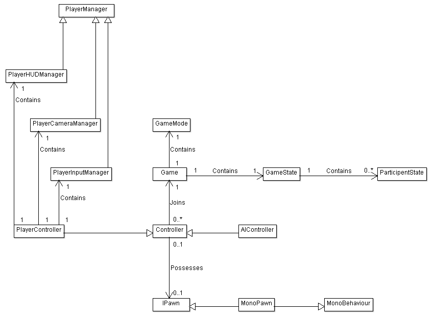

# Unity3D Gameplay Framework

## Introduction

All objects spawned in a Unity scene are <code>Behaviour</code>s. For local games we work with <code>MonoBehaviour</code>s and for networking games Unity provides us <code>NetworkBehaviour</code>s. Aside from those there aren't many abstractions where Unity supports us. I came to the conclusion that great gameplay support should be a feature that ships with the engine, finding myself abandoning projects because it doesn't. 

I've worked with [Unreal's Gameplay Framework](https://docs.unrealengine.com/latest/INT/Gameplay/Framework/QuickReference/) which I really like and therefore want to improve Unity's gameplay layer by adding some of the things I have learned from UE4 ([Unreal Engine 4](https://www.unrealengine.com/what-is-unreal-engine-4)). However, the existing <code>Behaviour</code> code base cannot be removed as it lies at the heart of the Unity Engine.

## Glossar
| Word          | Description           |
|:------------- |:--------------------- |
| Player        | A player is a real human. Note that AIs (Bots) are not players.      |
| Participant   | Players and AIs can become a participants when they request to join a game. Participants are taking part in the game and can interact with the world. They can have a huge imapact on the outcome of the game. A player spectator that is not able to interact with the world is not a participant for example. |
| Authority      | The authority can either be a local client, a remote client (Host) or a server. A networking game has many actions that require to be authorized before they can happen. Win/Loose conditions are usually evaluated by the authority to prevent cheating.    |

## The Gameplay Framework Classes

The GF (Gameplay Framework) consist of a few classes that help to structure gameplay logic. 

### General

#### Game Class
The <code>Game</code> class is a Singleton that provides general interaction with the game. <code>Controller</code>s join the <code>Game</code> to become participants for example.

#### GameMode Class
The <code>GameMode</code> only exists on the authority. The authority's <code>Game</code> instance contains the only <code>GameMode</code> across all participants. The <code>GameMode</code> constantly evaluates the <code>GameState</code> for new events that require authorization. It checks win/loose conditions as a common example.

#### GameState Class
All <code>Game</code>s across all participants contain a single <code>GameState</code>. As the name suggests, this class stores the state of the game. However, not all information about the game must be stored in this class. Only data that must be autorized is required to be available in the <code>GameState</code>.

#### ParticipentState Class
The <code>GameState</code> contains a collection of <code>ParticipantState</code>s. They contain the information of a participant that requires to be authorized. All participants have a registered <code>ParticipantState</code> but nor all controllers are participants.

### Controllers
A <code>Controller</code> represents the will of a player or an AI. It can possess a single pawn at the time and/or become a participant by requesting a join.

#### PlayerController Class
A <code>PlayerController</code> is a controller that represents the will of a player.

#### AIController Class
An <code>AIController</code> is a controller that represent the will of an artificial intelligence.

### Pawns
An <code>IPawn</code> is an entity that can become possessed by a single <code>Controller</code> at a time. When possessed, a pawn follows the instructions of its <code>Controller</code>.

#### MonoPawn Class
<code>MonoPawn</code>s are <code>IPawn</code>s that are used for local play. They inherit from <code>MonoBehaviour</code>.

#### NetworkPawn Class
<code>NetworkPawn</code>s are <code>IPawn</code>s that are used for network play. They inherit from <code>NetworkBehaviour</code> and are currently not implemented due to a focus on local play for a first version of the GF.

### PlayerManagers
<code>PlayerManager</code>s are associated by <code>PlayerController</code>s and handle the interaction between the game and the players. <code>AIController</code>s do not require <code>PlayerManager</code>s because an AI doesn't require visual feedback.

#### PlayerInputManager Class
A <code>PlayerInputManager</code> reads the input from the input devices of its player and prepares the information for its <code>PlayerController</code>. It does not interpret the input but is allowed to make device specific corrections such as applying a deadzone to an analogue stick.

#### PlayerCameraManager Class
<code>PlayerCameraManager</code>s are the camera men in a game. Their main job is to position and rotate the camera correctly as well as performing any post-processing on the rendered image.

#### PlayerHUDManager Class
A <code>PlayerHUDManager</code> is responsible to display a player's HUD (Heads Up Display). 
